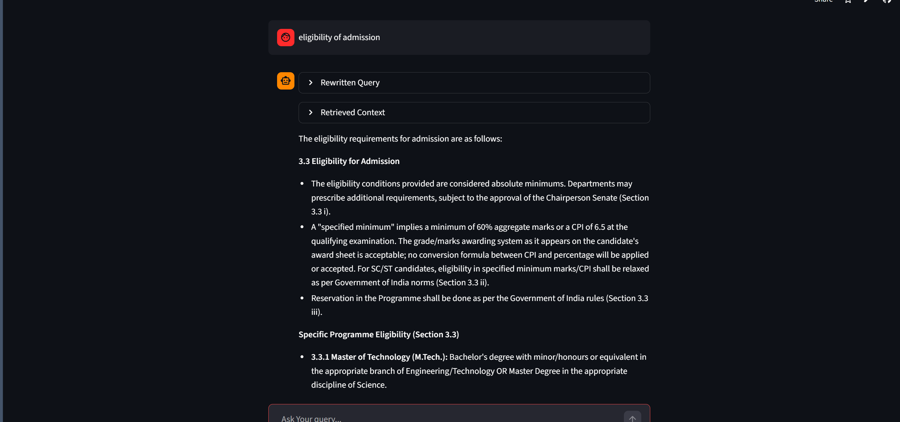
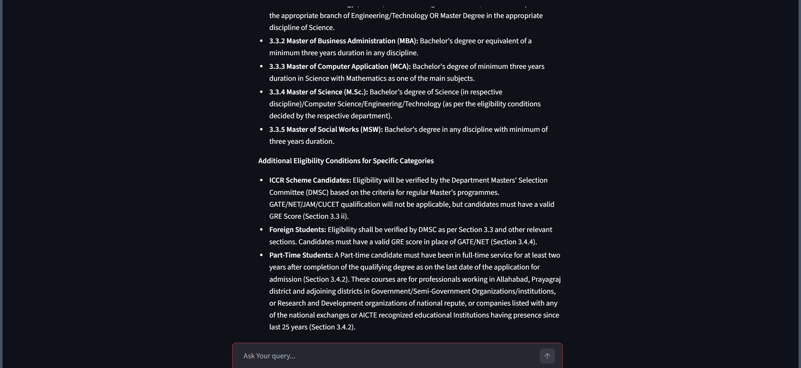

# rag-streamlit-pincone
 
<b>Retrieval-Augmented Generation (RAG) — Streamlit front-end + Pinecone vector store + Gemini embeddings & LLMs</b>

A compact, student-friendly RAG demo that ingests documents (PDF / text), creates embeddings, stores vectors in Pinecone, and serves an interactive Streamlit question-answering UI with source attribution

<h2> Screenshots</h2>

<b>Application Interface</b>

  
  

<h2>Use Cases</h2>
<ul>
    <li><b>Enterprise Policy Chatbot:</b> Employees query HR policies and internal documents with source-backed answers.</li>
    <li><b>Knowledge Base Assistant:</b> Semantic search across SOPs, technical docs, and company knowledge.</li>
    <li><b>Customer Support Bot:</b> Answer product queries grounded in official manuals and FAQs.</li>
    <li><b>Academic Research Assistant:</b> Interactive Q&A over research papers with citation support.</li>
    <li><b>Legal & Compliance Search:</b> Retrieve specific clauses from contracts and regulatory documents.</li>
</ul>

<h2> Features</h2>
<ul>
    <li>Semantic search using Pinecone vector store</li>
    <li>Query rewriting using Gemini for improved retrieval</li>
    <li>Context-aware answers using RAG architecture</li>
    <li>Interactive chat UI built with Streamlit</li>
    <li>Session-based conversation memory</li>
    <li>Debug view for rewritten queries and retrieved context</li>
</ul>

<h2> Tech Stack</h2>
<ul>
    <li><b>Frontend:</b> Streamlit</li>
    <li><b>LLM:</b> Google Gemini (gemini-2.5-flash)</li>
    <li><b>Embeddings:</b> Gemini Embedding Model</li>
    <li><b>Vector Database:</b> Pinecone</li>
    <li><b>Framework:</b> LangChain</li>
</ul>